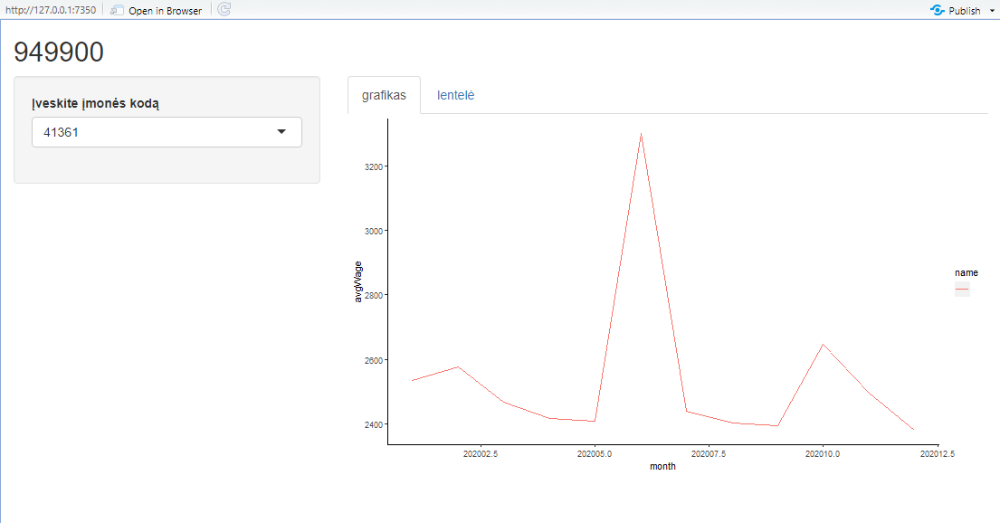

# R Laboratorinis darbas: duomenų vizualizacija

| Variantas | ecoActCode |
|------------- | ------------- |
|12   | 949900 |

### 1. Užduotis

Atsakymas:

Išvados:

### 2. Užduotis

Atsakymas:

Išvados: visų įmonių vidurkiai labiausiai padidėja pirmajame pusmetyje

### 3. Užduotis

Atsakymas:

Išvados: "Lietuvos Respublikos transporto priemonių draudikų biuras" apdraudžia daugiausiai savo darbuotojų, o mažiausiai (Alcon Pharmaceuticals Ltd Atstovybė)

### 4. Užduotis

Shiny R aplikacijos nuotrauka:

